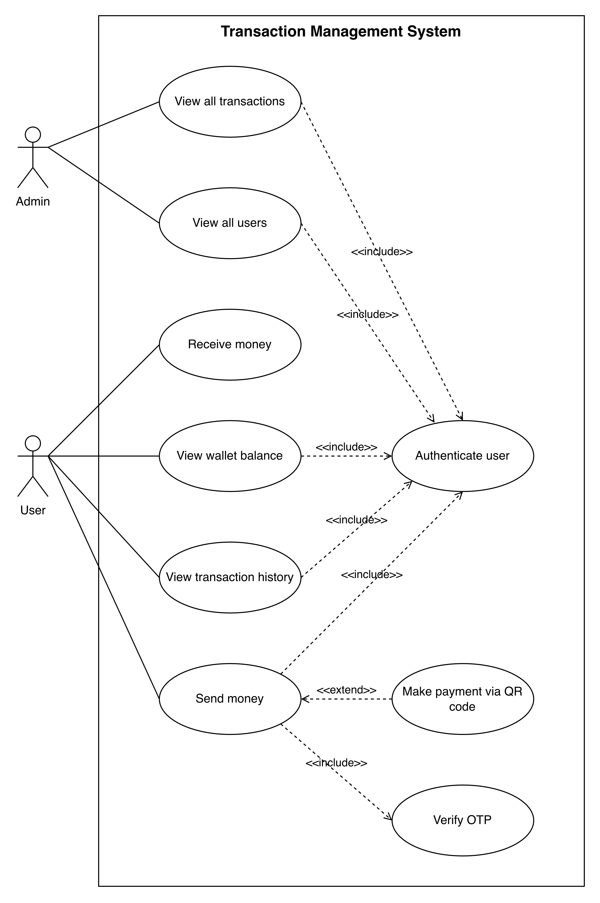

# CPS449-Group5-COIL
Group Repository for CPS449 COIL Project

## Professor
- Dr. Phu H. Phung | pphung1@udayton.edu

## Students
- Max Weitz | weitzm4@udayton.edu
- Claire Summers | summersc3@udayton.edu
- Dang Khoa Phan | phand2@udayton.edu
- Anastasia Butler | butlera14@udayton.edu
- Tran Anh Van
- Nguyen Ngoc Van Anh
- Nguyen Huynh Ngan Anh
- Nguyen Dinh Long
- Vo Nguyen Dinh Bao

## Project: Aegis-Pay

### Number of Commits per member

| Member | Front End | Back End | Total |
|---|---:|---:|---:|
| Max Weitz | 3 | 9 | 12 |
| Claire Summers | 6 | 17 | 23 |
| Dang Khoa Phan | 26 | 12 | 38 |
| Anastasia Butler | 8 | 7 | 15 |

## Project Management

### Management Board(private access): 
https://coilteam5.atlassian.net/jira/software/projects/KAN/list?jql=project+%3D+KAN+ORDER+BY+created+DESC&atlOrigin=eyJpIjoiMzhmMTc5NzE1MjNkNDhjMDhjZThmMjk4YWQ4YTMyN2YiLCJwIjoiaiJ9 

### URL to the cloud deployed front-end
https://cps449-group5-coil.github.io/

### URL to the cloud deployed back-end/microservice 
https://coilmicroservice-docker.azurewebsites.net/

### URL to the Aegis-Pay deployed backend
https://aegis-pay-geaze6a4h0a4czhk.canadacentral-01.azurewebsites.net/

## Overview
For the COIL Project, our team has landed on making an Bank Transaction Managment System. 

This system allows for customers to check the money that they have in their bank account alongside with viewing transactions to their account, view their wallet balance, revieve money, and send money to other people. This includes an ability to transfer internationally with an automatic currency conversion, as well as an AI chatbot to help with any processes when using the app.

On the flipside, the admins of the Transaction Management System is able to view all the transactions preformed within the app and view the users of the application. 

Within both these processes there is a built in authentication procedure in order to ensure the users are of the right identity when going to access the sensitive banking information.

## System Analysis

### High-level Requirements
Intelligent Microservice: 
For our project we decided to focus on developing an AI assistant to help with the navigation of the Bank Transmission Management System in order to ensure that users know how to use the app.

Cloud Deployment: 
We deployed the microservice to Azure.

Front-End: 
Our front-end UI features a popup chat in which the user can talk to the AI Assistant to get help on any questions that are troubling the user.

### Use cases
Use-case Diagram

Shows how the users of the system interact with the banking system and how they are connected with one another. 
Explains how the functionality of the banking system should be at the end of implimentation. 

### ER Diagram
How the Users and Administrators are connected to the Transaction Management System in detail.  

## System Design

### Database
All transactional and account information is handled through an SQL database. This database is managed by the Vietnam team, but we have editing access that we can use to add accounts and update the money in those accounts.

### User Interface
The current interface was designed and implemented by the Vietnam team. They opted for a sleek simple design that could be compared to venmo or cashapp. This interface has many dynamic buttons and elements. 

## Implementation

### AI Chatbot Microservice
- The user can ask the bot for assistance on how to use the system. 
- There may be users who are unfamiliar with the app and the services it provides.
- Can help the user in real time with specific questions.

### Adding US Country Code +1

- Originally the banking service only had support for those with a Vietmanese country code. (+84)
- We manually added the functionality of US country code. (+1)
- This gave us access to the full system, which allowed us to test the system with our US phone numbers.

### International Transfer

- In our microservice, we added a function for transferring money internationally.
- Finds the country code of the user and recipient using their provided phone number.
- Microservice process:
    - Pass in the sender and recipient’s country code
    - Automatically converts sender’s transfer amount into the recipient’s currency using an open sourced currency exchange             rate API
    - Returns the new converted amount

### Deployment
- The microservice was deployed to Azure.
- Docker hub was used to build and host images. 

## Impacts on the Industry
This project is based on a banking system that provides users a new and simple-to-use payment provider, similar to that of PayPal and CashApp. 

- New competition can lead to better improvements for all money transfer apps.
- Simplifies transferring money internationally, better connecting those across borders.

## Impacts Working witha a Team Abroad

This project shows both the benefits and hardships that come with overseas projects.

Pros:
- Continuous workflow
- People with different perspectives sharing different ideas
- Able to divide and conquer on team goals 
- Learn to work around issues caused by miscommunications

Cons:
- Communication issues, sometimes would spend 5 days without hearing back
- Main App given to us pretty late in the project, so it was hard to have enough time to implement and test
- Main App structure was confusing to navigate, especially initially. There wasn’t a clear way to see how the app was structured, provided with no user guide.

## Conclusion

In conclusion, we believe that we have taken away a lot from the project such as…

- Working to learn a system and navigate based on the diagrams we were given
- Recognizing that there may be bumps, however navigating through said hardships and adapting in order to minimize the effects
- Working beyond a language barrier helps promote growth in furthering communication abilities

While there definitely were a lot of hardships such as the communication issues we were experiencing and being given the main application pretty late in the process we found it a bit challenging, however ultimately we were able to adapt and overcome to the best of our abilities which has helped us better ourselves as a team and individuals.

## User guide/Demo
Demo Video: https://cps449-group5-coil.github.io#demo-video 

Live Demo: https://cps449-group5-coil.github.io/app

